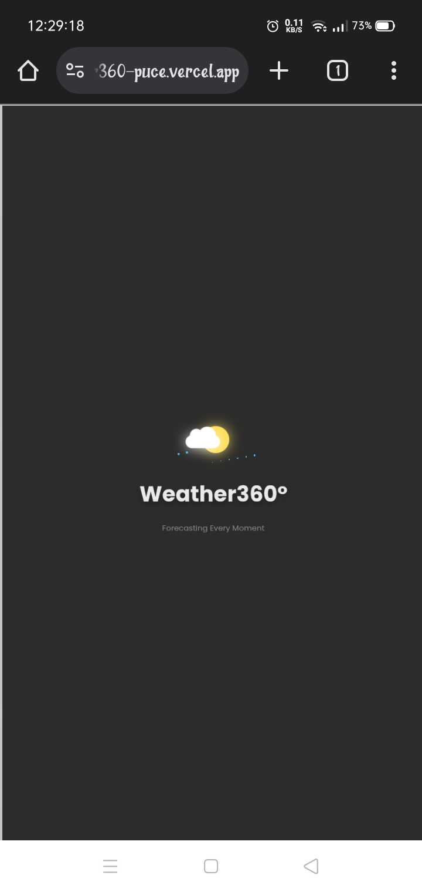
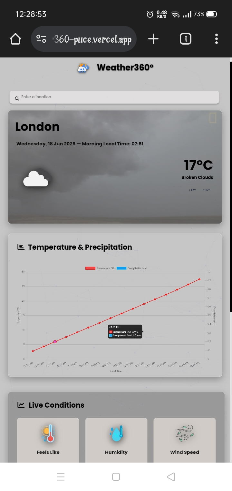
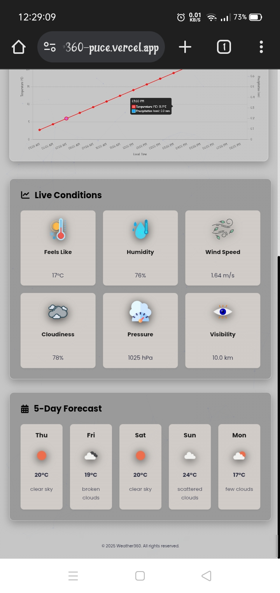
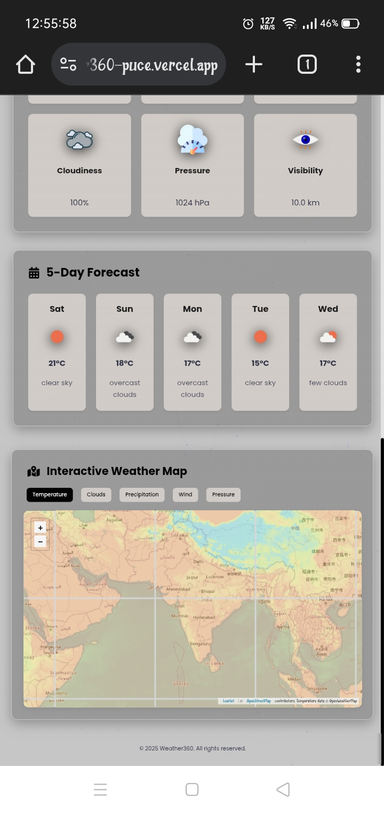
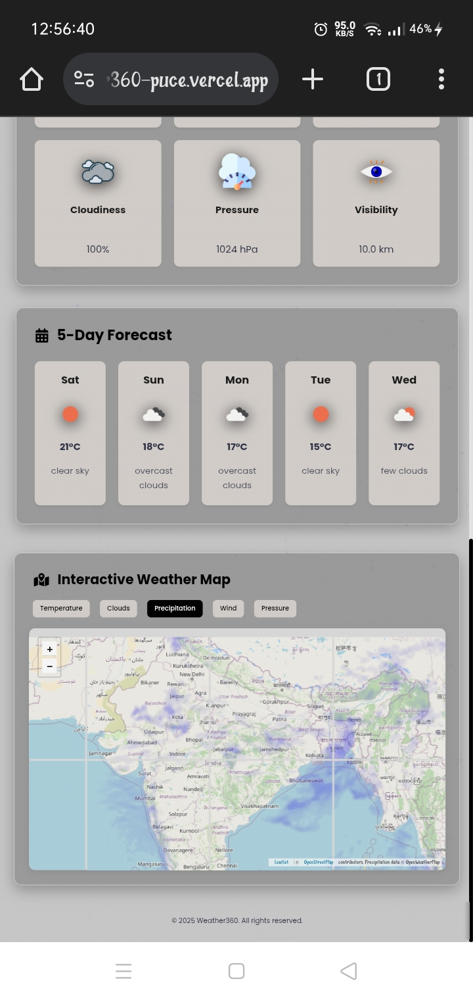
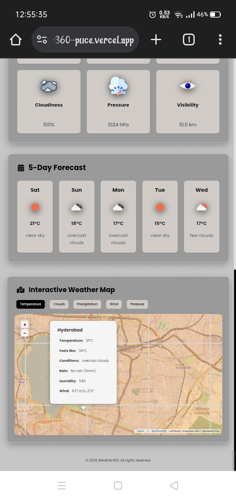

# Weather360° - Interactive Weather Dashboard


 






A modern, visually stunning weather application that provides real-time weather data, forecasts, and interactive maps with beautiful animations and dynamic backgrounds.

## Features ✨

### 🌍 Current Weather
- Real-time temperature, conditions, and feels-like temperature
- Min/max temperatures with visual indicators
- Local time and date display
- Dynamic background that changes with weather conditions

### 📊 Interactive Charts
- 16-hour temperature and precipitation forecast
- Animated current time indicator
- Interactive tooltips with detailed data

### 🗺️ Weather Map
- **5 Interactive Layers**:
  - Temperature heatmap
  - Cloud cover visualization
  - Precipitation intensity
  - Wind speed and direction
  - Atmospheric pressure
- **Hover Tooltips**: See weather data for any location
- **Click Popups**: Get detailed weather info for any point on the map

### 🌦️ 5-Day Forecast
- Daily weather predictions at a glance
- Weather condition icons
- Temperature ranges

### 🎨 Visual Design
- Dynamic particle background
- Weather-appropriate animations
- Responsive layout for all devices
- Smooth transitions and loading effects

## Technologies Used

- **Frontend**: HTML5, CSS3, JavaScript
- **APIs**: OpenWeatherMap API
- **Libraries**:
  - Chart.js for data visualization
  - Particles.js for interactive background
  - Animate.css for animations
  - Font Awesome for icons
- **Fonts**: Google Fonts (Poppins)

## Installation

1. Clone the repository:
   ```bash
   git clone https://github.com/arunrao605/Weather360.git
